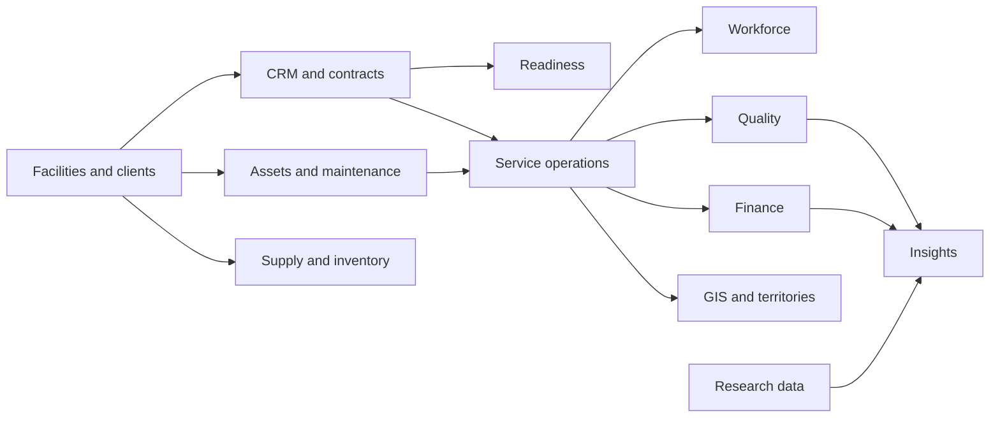

# Apex data platform

Apex is a fictional, AI- and data-analytics-enabled facilities maintenance management platform. Its connected data lets you practise how professional teams combine operational, business, spatial and research information without using real customer or student records.

## The twelve connected domains

| Shared schema | What it represents | Examples of connections |
| --- | --- | --- |
| `shared_facilities` | Clients, facilities and spaces | The foundation for most other domains |
| `shared_crm` | Opportunities and contracts | Connects clients and facilities to service agreements |
| `shared_readiness` | Mobilizations and readiness tasks | Tracks the work needed before a contract goes live |
| `shared_operations` | Service types, visits and work orders | Connects contracts, facilities, assets and scheduled work |
| `shared_workforce` | Employees, skills and shifts | Connects people and skills to facility work |
| `shared_quality` | Inspections, findings and feedback | Measures service outcomes for facilities and clients |
| `shared_assets` | Assets, maintenance plans, events and sensors | Supports preventive and corrective maintenance analysis |
| `shared_supply` | Vendors, products and inventory activity | Tracks materials used at facilities |
| `shared_finance` | Estimates, invoices and costs | Connects proposals and service delivery to financial results |
| `shared_insights` | Monthly metrics and customer segments | Provides analysis-ready summaries across domains |
| `shared_spatial` | Service territories and route events | Adds PostGIS locations and boundaries to operational work |
| `shared_research` | Dataset catalogue, packages and observations | Records provenance, licensing, quality and approved research data |

## How the domains depend on one another

The central path begins with a client and facility. A contract can create readiness work, scheduled service, staffing, inspections, costs and invoices. Assets, inventory, locations and research data extend that core path.



The diagram is a learning map, not a rule that every query must follow. Foreign keys in PostgreSQL preserve the exact record-level relationships.

## Shared data and your workspace

The shared schemas are read-only. You can use `SELECT`, joins, filters and aggregations, but you cannot change the shared records. This protects the common starting point for everyone.

Your course enrollment provides a separate writable workspace schema. Use that workspace for tables, cleaned data, features, model outputs and other lab results that your instructions ask you to save. Work from one course must remain in that course's workspace.

```sql
SELECT facility_id, facility_name, city
FROM shared_facilities.facilities;
```

Your lab will provide the exact name of your writable schema. Do not store passwords, personal information, grades or another student's work in the database or repository.

## Your local workflow

1. Use DBeaver Community to explore tables, inspect relationships and test SQL.
2. Use VS Code to write the Python and Streamlit code required by your lab.
3. Run Streamlit locally in your browser.
4. Read approved shared data and save required results only to your course workspace.
5. Validate your result using the checks supplied with the lab.
6. Commit only the student-facing files requested by your course instructions.

DBeaver and your local Streamlit application can connect to the same PostgreSQL database. A committed database change becomes visible to both tools after the current transaction completes and the query or page is refreshed.

If an online connection is unavailable, use the CSV or Parquet fallback included with the lab. Do not replace shared tables or invent a different dataset without course approval.

## Safe platform evolution

The shared platform changes through numbered database migrations. A migration adds or adjusts database objects in a repeatable order while preserving a record of what has already been applied.

- Treat existing migration files as platform history; do not edit or rename them.
- Additive changes are preferred so existing labs and queries keep working.
- New tables must connect through documented keys where a business relationship exists.
- New datasets must record source, licence, version, permitted use, attribution and quality notes.
- Schema changes must be validated before a lab package is released.
- Your personal lab tables belong in your writable workspace, not in shared migrations.

This structure lets the Apex platform grow across courses while keeping shared data stable and each student's assessed work isolated.
